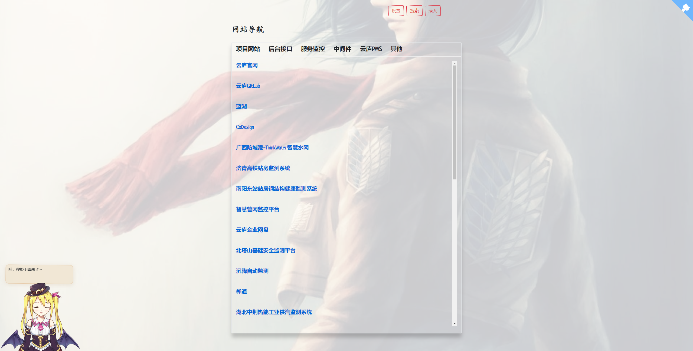

A privacy-first, lightweight website navigation service developed based on the Python framework PyWebIO.

<a href="https://github.com/waisaa/web-nav">Home Page</a> •
<a href="https://blog.csdn.net/qq_42761569?type=blog">Blogs</a>

[](http://localhost:7777/) [](https://pywebio.readthedocs.io/) [](https://github.com/waisaa/web-nav/tree/main/LICENSE)



## Key points

- **Open source and free to use**. Embrace a future where creativity knows no boundaries with our open-source solution. All features are free to use and will never be charged in any form or content.
- **Self-hosting with Docker in just seconds**. Enjoy the flexibility, scalability, and ease of setup that Docker provides, allowing you to have full control over your data and privacy.
- **Pure text with added Markdown support.** Say goodbye to the overwhelming mental burden of rich formatting and embrace a minimalist approach.
- **Customize and share your notes effortlessly**. With our intuitive sharing features, you can easily collaborate and distribute your notes with others.
- **RESTful API for third-party services.** Embrace the power of integration and unleash new possibilities with our RESTful API support.

## Deploy with Docker in seconds

```bash
docker run -d --name memos -p 5230:5230 -v ~/.memos/:/var/opt/memos neosmemo/memos:stable
```

> [!NOTE]
> This command is only applicable for Unix/Linux systems. For Windows, please refer to the detailed [documentation](https://www.usememos.com/docs/install/self-hosting).
>
> The `~/.memos/` directory will be used as the data directory on your local machine, while `/var/opt/memos` is the directory of the volume in Docker and should not be modified.

Learn more about [other installation methods](https://www.usememos.com/docs/install).

## Contribution

Contributions are what make the open-source community such an amazing place to learn, inspire, and create. We greatly appreciate any contributions you make. Thank you for being a part of our community! 🥰
